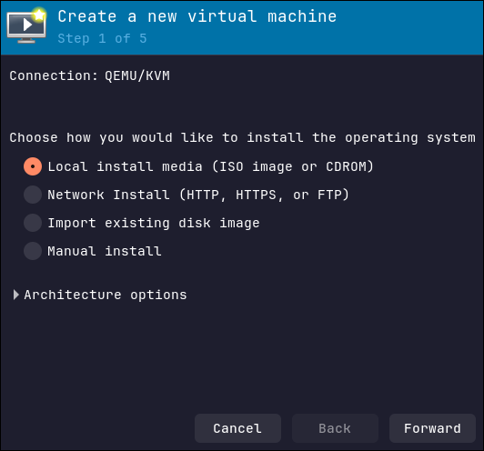
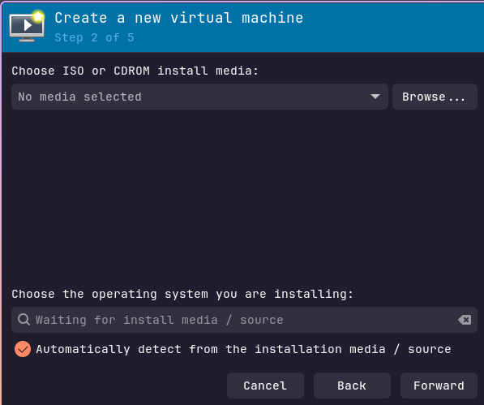
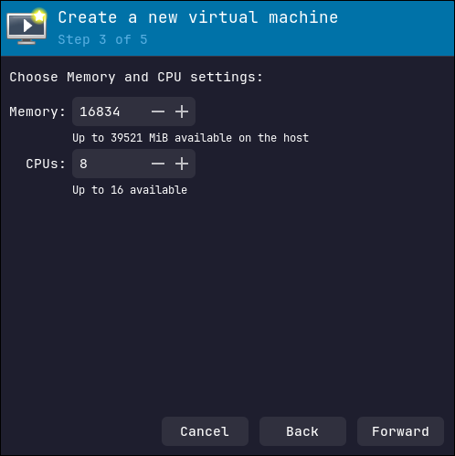
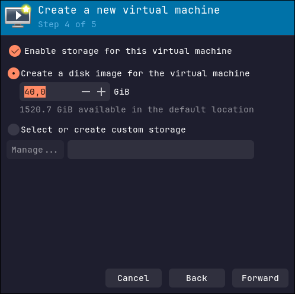
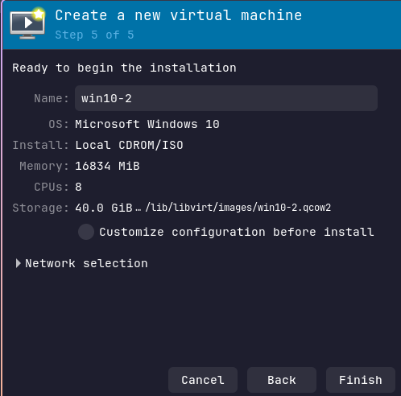
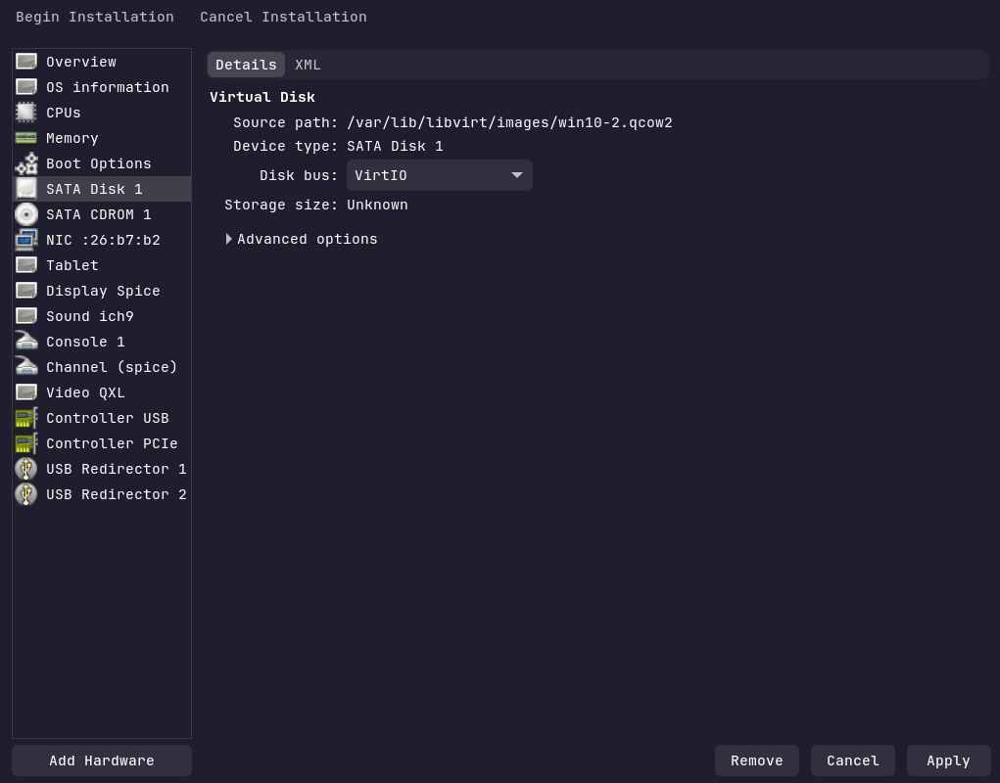
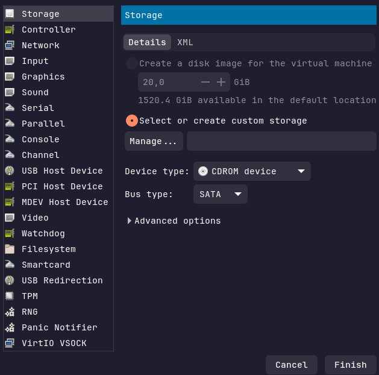
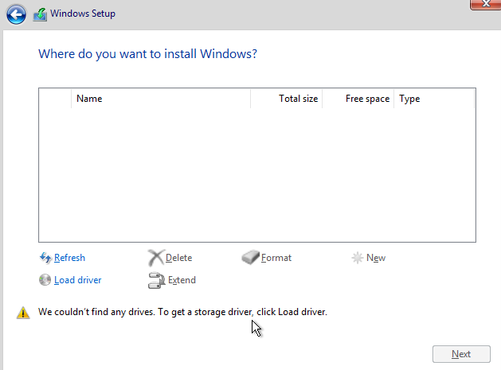
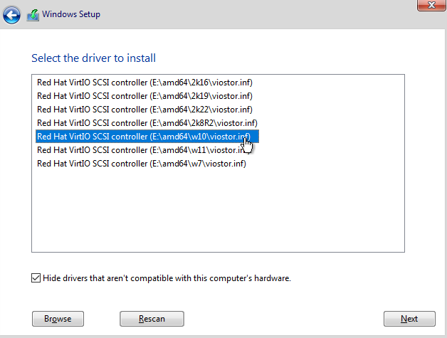

- # Postup získání disku
	- ## Prerekvizity
		- [Windown 10 ISO](https://www.microsoft.com/cs-cz/software-download/windows10ISO) nebo [Windows 11 ISO](https://www.microsoft.com/software-download/windows11)
		- [virtIO drivers ISO](https://fedorapeople.org/groups/virt/virtio-win/direct-downloads/latest-virtio/virtio-win.iso)
	- ## Tvorba disku s instalací Windows
		- ### Instalace virt-manageru
			- Pro pohodlnější použití KVM (kernel-based virtual machine) a QEMU využijeme aplikaci `virt-manager`, která nám poskytkne grafické rozhraní pro `libvirt`
			- Příkaz `sudo zypper install virt-manager libvirt` nainstaluje aplikaci `virt-manager` a samotné rozhraní `libvirt`
			- `sudo reboot` pro restart systému
			- Nyní můžeme `virt-manager` spustit
		- ### Vytvoření disku
			- Na úvodní straně uvidíme v levém horním rohu následující set ikon
				- 
					- První ikona slouží pro vytvoření VM
			- Následující okno
				- 
					- Chceme ponechat volbu `Local install media` - použijeme již stažené ISO Windows
					- V možnostech architektury ponecháme x86_64
			- Výběr instalačního ISO
				- 
					- Zvolíme ISO s Windows 10 nebo 11
					- Pokud se automaticky nezvolí námi chtěný systém, odškrtneme automatickou detekci a zvolíme Microsoft Windows 10 nebo 11 (dle námi použité verze)
			- Přiřadíme VM RAM a CPUs
				- 
				- Minimální množství je 4096 MB a 2 CPU pro Windows 10
				- Více přiřazených zdrojů umožní rychlejší instalaci
			- Následuje volba velikosti disku
				- 
				- Velikost tohoto disku určuje dostupnou kapacitu, kterou bude celá instalace mít. Musíme počítat i s velikostí testované aplikace
				- Je nutno mít na paměti, že tento disk bude existovat v době testování "2x" -> 1 instance bude sloužit jako template, ze kterého se budou tvořit disky pro testy a druhý bude samotný disk workera, který testy provádí
			- V posledním okně pouze vybereme možnost úprav konfigurace před instalací
				- 
			- Zde musíme provést dvě změny konfigurace před zahájením instalace
				- 
				- Změnit Disk bus u disku SATA Disk 1 ze `SATA` na `VirtIO`
				- 
				- Využít možnost `Add Hardware` a přidat `Storage` -> device type - CDROM
					- Zde přiřadíme VirtIO Drivers ISO
			- Poté můžeme zahájit instalaci
				- Jakmile se dostaneme do bodu s výběrem disku, narazíme na problém, kdy Windows nevidí disk
				- 
				- Zvolíme `Load driver`
				- 
				- Ovladače se automaticky načtou z druhé virtualizované CDROM
				- Vybereme možnost s cestou obsahující w10 nebo w11 dle použité verze operačního systému
			- Dokončíme instalaci a prvotní nastavení
			- Nyní můžeme instalaci systému doplnit o další aplikace, ovladače nebo další nastavení. Po dokončení tvorby základního "šablonového" disku Windows systém vypneme
			- Výsledný soubor .qcow2 soubor s diskem je připraven pro další použití
- # Příprava testovacího rozhraní
	- Soubor `templates`, který je součástí git repozitáře, obsahuje předdefinovaný TestSuite pro Windows
	- Zároveň jsou zde obsažené i základní testy připravené pro platformu Windows
	- Soubor s diskem překopírujeme na disk systému OpenSUSE, kde máme funkční OpenQA instanci
	- Nyní už můžeme disk buď rovnou zkopírovat do `/var/lib/openqa/factory/hdd` (v tom případě stačí přeskočit na sekci Testování), nebo provedeme další nezbytnou konfiguraci, která nám umožní automaticky vytvořit vždy novou kopii disku na začátku testu a po jeho dokončení ji smazat
	- Nejprve změny v `/etc/openqa/openqa.ini`
		- v sekci `[global]` je položka `download_domains`
			- odstraníme `#` a jako platnou doménu nastavíme `0.0.0.0` (případně jiný server, ze kterého budeme stahovat disk)
		- sekce `[default_group_limits]`
			- `asset_size_limit` nastavíme maximální velikost disku nebo ISO souboru, který může zůstat uložený na disku i po dokončení testu
				- hodnota se udává v GB
				- 10 (GB) by měla být dostatečná velikost, která zabrání smazání ISO souborů, ale zároveň smaže využitou kopii disku
		- v sekci `[minion_task_triggers]` je položka `on_job_done`
			- zde můžeme nastavit aktivity, které se spustí po dokončení testovacího jobu
			- nás zajímá pouze možnost `limit_assets`
		- Po dokončení výše uvedených úprav soubor uložíme a restartujeme celý OS
	- Vytvoření HTTP serveru, který bude poskytovat data
		- Přejdeme v konzoli do složky na našem OpenQA host systému, kde máme uložený disk
		- Příkazem `sudo chown $USER jméno_disku.qcow2` změní vlastnictví disku na současného uživatele
		- Nyní můžeme využít SimpleHTTPServer pro poskytování souborů z této složky
			- `python3 -m  http.server 8000` vytvoří server na adrese `0.0.0.0:8000`
			- Můžeme také povolit port 8000, abychom server zpřístupnili pro všechny zařízení v lokální síti
	- Můžeme pokračovat s testováním
- # Testování
	- Soubor `templates` obsahuje upravené šablony pro použití s Windows
	- Příkaz, který spustí testy s Windows, je `openqa-cli api -X POST isos DISTRI=apptest VERSION=Windows FLAVOR=Windows ARCH=x86_64 BUILD=Windows HDD_1_URL=http://0.0.0.0:8000/DRIVE_NAME.qcow2 --apikey APIKEY --apisecret APISECRET`
		- `VERSION` a `FLAVOR` jsou proměnné, které spustí specifický TestSuite pro Windows (vše je nastavené v `templates`)
