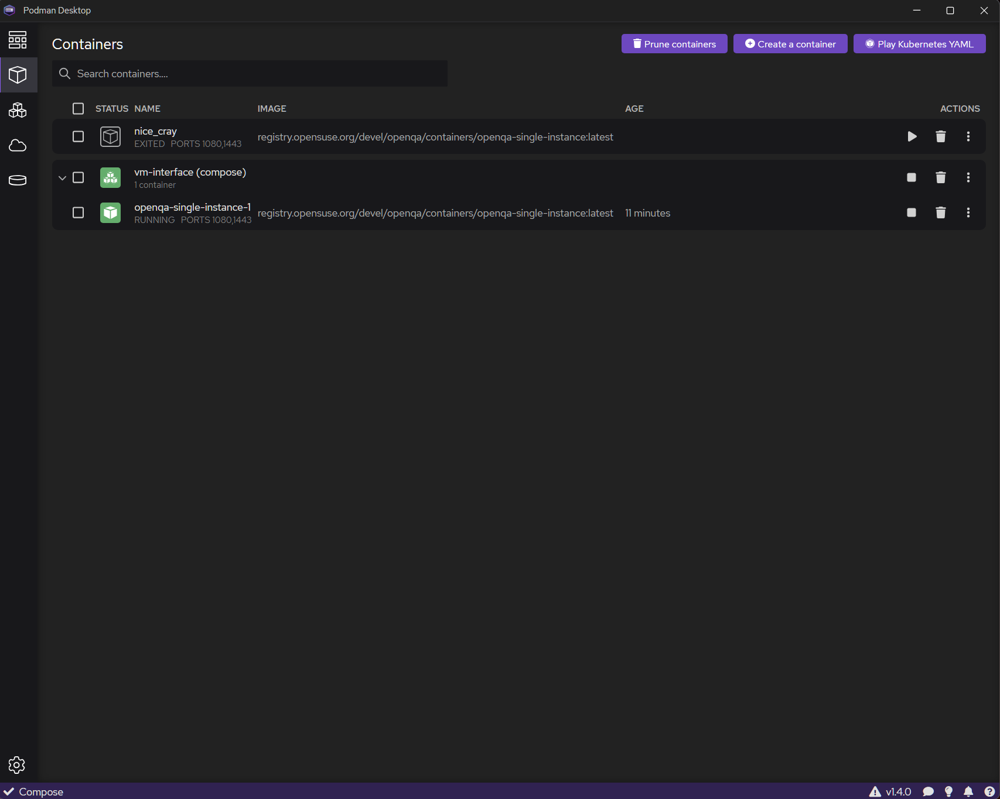
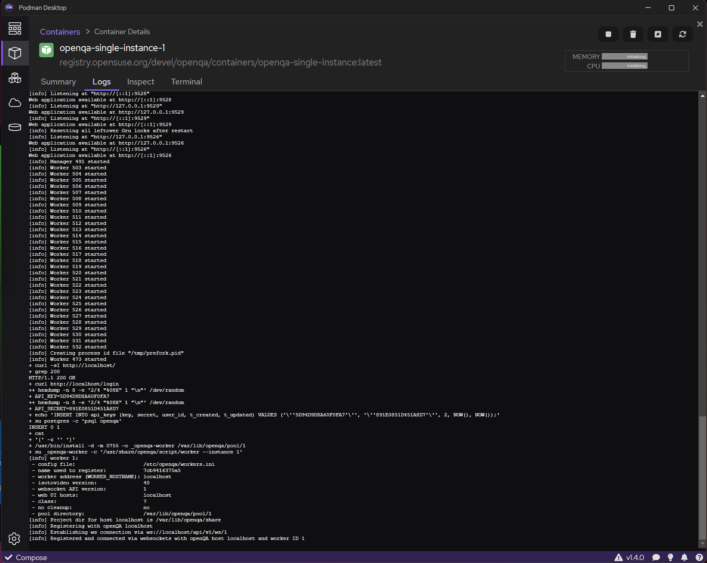
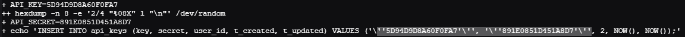
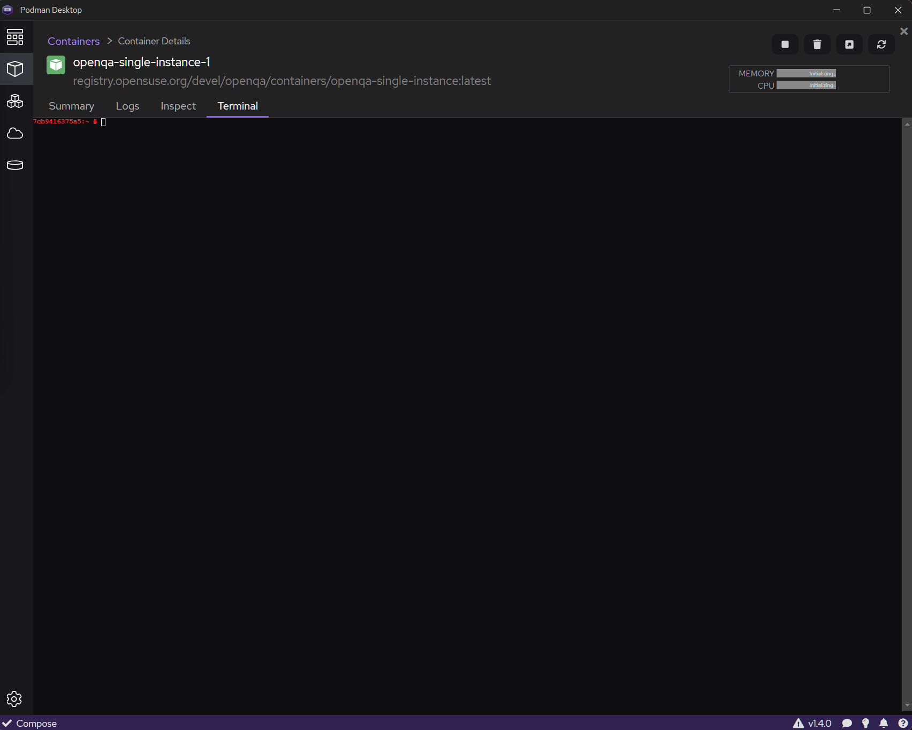

# OpenQA

This repository contains files for my Bachelor's thesis regarding automated visual app testing with the OpenQA framework.

## Setup using OpenSUSE VM

 - Prepare OpenSUSE VM with your hypervisor of choice

    - Tested with KVM/QEMU - 6 vCPUs, 16 GB RAM, 128 GB drive

 - Run following bootstrap command from OpenQA

 `curl -s https://raw.githubusercontent.com/os-autoinst/openQA/master/script/openqa-bootstrap | bash -x`

 - Clone the repository

 `git clone github.com/vactomas/openqa-app-testing.git`

 - Use bindfs to bind the folder to the correct place or just move them (bindfs will be the preferred option, but currently we will just move the folders manually for testing purposes)

 `mv openqa-app-testing/testplatform/* /var/lib/openqa/tests/apptest/`
 
 - Download OpenSUSE KDE-Live ISO and move it to OpenQA iso folder

 `mv ISONAME.iso /var/lib/openqa/factory/iso/`

 - Setup is now complete, you can move along to testing

## Single instance container setup using docker-compose

 - Install Podman Desktop - https://podman.io/

 - Clone the repository
 
 `git clone github.com/vactomas/openqa-app-testing.git`

 - Go into the directory and create folders iso and tests

 `cd openqa-app-testing/ && mkdir iso && mkdir tests`

 - Create the containers using the docker compose engine 

 `docker-compose up -d`

 - Inside Podman Desktop go to the Containers tab

 

 - Select the openqa-single-instance-1 container

 - Go to the Logs

 

 - Find the API Key and Secret value and write it down

 

 - Go to the Terminal tab

 

 - This example will use the OpenSUSE Live environment. To download OpenSUSE factory tests, use the following commands

 `/usr/share/openqa/script/fetchneedles`
 `/var/lib/openqa/share/tests/opensuse/products/opensuse/templates --apikey APIKEY --apisecret APISECRET` - replace APIKEY and APISECRETS with values you extracted earlier from Logs
 
 - Download the ISO file you want to test and copy it to the ./iso/ folder located in the folder, where docker-compose.yml is located. 

 - Copy the ISO file from /iso-images/ to /var/lib/openqa/share/factory/iso/

## Testing

 - Use the following command to start the test of the iso

`openqa-cli api -X POST isos \
        ISO=ISONAME.iso \
        DISTRI=apptest \
        VERSION=Tumbleweed \
        FLAVOR=KDELive \
        ARCH=x86_64 \
        BUILD=BUILDID \
        APP=qalculate \
        URL=https://github.com/Qalculate/qalculate-gtk/releases/download/v4.9.0/qalculate-4.9.0-x86_64.tar.xz \
        --apikey APIKEY --apisecret APISECRET`

ISONAME and BUILDID are variables that need to be changed. The rest of this command presumes that you are using KDE-Live version of Tumbleweed. APP and URL are custom variables used as a part of demonstration test. APIKEY and APISECRET can be found at http://127.0.0.1/api_keys 
